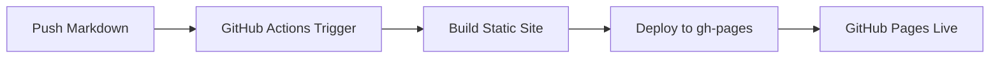

# Truth Network - GitHub Anonymous Deployment

## 專案簡介

本專案用於 **個人研究目的**，旨在探索網路資訊傳播、事實查證及數位素養相關議題。

> ⚠️ **聲明**：本專案僅供學術研究和個人學習使用，不涉及任何政治活動或敏感內容。

---

## 匿名帳號設定

### GitHub 帳號建議

```
帳號名格式：real_[研究主題]_[識別碼]
範例：
- real_media_literacy_tw
- real_factcheck_research
```

### 建立匿名帳號的建議

1. **不要使用個人真實資訊**
   - 不要使用真實姓名
   - 不要使用個人電話號碼
   - 不要使用個人主要 Email

2. **使用一次性或專用 Email**
   - 可使用 ProtonMail、Tutanota 等隱私取向郵件服務
   - 或使用郵件轉址服務（如 SimpleLogin、AnonAddy）

3. **瀏覽器防護**
   - 使用 Tor Browser 註冊
   - 或使用無痕模式 + VPN

---

## 匿名信箱設定建議

### 推薦的隱私郵件服務

| 服務 | 類型 | 特色 |
|------|------|------|
| **ProtonMail** | 免費/付費 | 端到端加密、瑞士管轄 |
| **Tutanota** | 免費/付費 | 德國隱私保護、加密日曆 |
| **SimpleLogin** | 免費/付費 | 郵件別名轉址、可自訂網域 |
| **AnonAddy** | 免費/付費 | 匿名郵件轉址、進階隱私 |

### 設定步驟

1. 使用 Tor Browser 訪問 ProtonMail (proton.me)
2. 選擇免費方案
3. 不要輸入真實姓名
4. 完成驗證（可用虛擬手機號碼接收簡訊）
5. 啟用兩步驟驗證（使用 Authy 或 Aegis App）

---

## GitHub Actions 自動部署

### Workflow 設定

本專案使用 GitHub Actions 自動部署到 GitHub Pages。

**主要功能**：
- 自動偵測 Markdown 檔案變更
- 使用 Docusaurus 或 Hugo 生成靜態網站
- 自動部署到 `gh-pages` 分支

### 部署流程



---

## 部署到 GitHub Pages 的步驟

### 1. 建立 Repository

1. 使用匿名帳號登入 GitHub
2. 建立新的 Public Repository
3. Repository 名稱建議：`truth-net-[研究代號]`

### 2. 啟用 GitHub Pages

1. 進入 Repository → Settings → Pages
2. Source 選擇 **Deploy from a branch**
3. Branch 選擇 **gh-pages** / **(root)**
4. 點擊 Save

### 3. 設定 Workflow

1. 將本目錄中的 `.github/workflows/deploy.yml` 複製到你的 Repository
2. 修改 `publish_dir` 為你的靜態網站輸出目錄
3. Push 到 main 分支後，會自動觸發部署

### 4. 驗證部署

1. 前往 `https://[你的帳號名].github.io/[repo名稱]/`
2. 確認網站正常顯示

---

## 安全建議

### 基本原則

- 🔒 永遠使用 HTTPS
- 🔑 定期更換密碼
- 📱 啟用兩步驟驗證
- 🧅 使用 Tor 瀏覽敏感內容

### 帳號隔離

- 為此專案使用獨立的瀏覽器 Profile
- 不要與個人帳號混用相同瀏覽器
- 考慮使用專用的 VPN 或代理

### 資料備份

- 將 Repository 備份到本機或其他雲端
- 使用加密硬碟儲存敏感資料
- 定期匯出郵件和設定

---

## 授權

本專案採用 [MIT License](LICENSE) 開源授權。

---

## 聯繫

如有問題，請透過以下方式聯繫：

- Email: [通過匿名信箱聯繫]
- GitHub Issues: 提交問題回報

> ⚠️ 提醒：本專案僅供研究用途，請確保你的使用符合當地法規。
